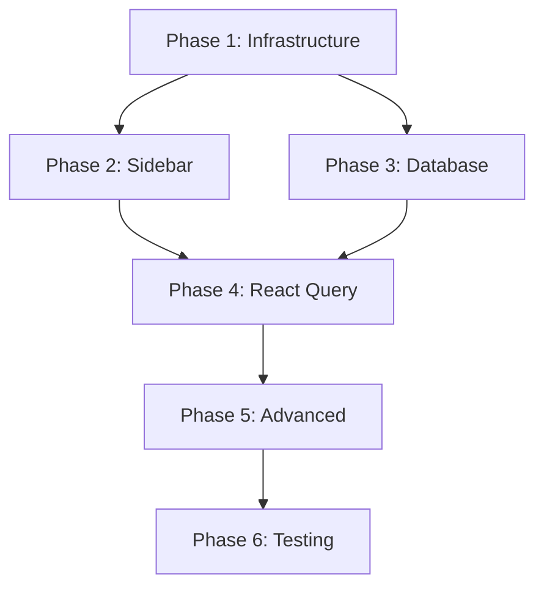

# 🚀 E-Wheels Performance Optimization - Complete Execution Plan

## 📋 Overview

Transform the application from slow to lightning-fast with a systematic 6-phase approach targeting all performance bottlenecks.

**Total Duration:** ~95 minutes  
**Expected Performance Improvement:** 60-85% faster across all metrics

---

## Phase 1: Core Infrastructure Setup ⚡

**Duration: 15 minutes | Impact: Foundation for all optimizations**

### 1.1 Install TanStack Query

```bash
npm install @tanstack/react-query @tanstack/react-query-devtools
```

### 1.2 Set Up Query Client Provider

Create `src/lib/react-query/query-client.ts`:

```typescript
import { QueryClient } from '@tanstack/react-query';

export const queryClient = new QueryClient({
  defaultOptions: {
    queries: {
      staleTime: 5 * 60 * 1000, // 5 minutes
      cacheTime: 10 * 60 * 1000, // 10 minutes
      refetchOnWindowFocus: false,
      retry: 2
    },
    mutations: {
      retry: 1
    }
  }
});
```

Update `src/components/layout/providers.tsx`:

```typescript
import { QueryClient, QueryClientProvider } from '@tanstack/react-query';
import { ReactQueryDevtools } from '@tanstack/react-query-devtools';

export function Providers({ children }: { children: React.ReactNode }) {
  return (
    <QueryClientProvider client={queryClient}>
      {children}
      {process.env.NODE_ENV === 'development' && (
        <ReactQueryDevtools initialIsOpen={false} />
      )}
    </QueryClientProvider>
  );
}
```

### 1.3 Dev Tools Setup

- Enable React Query DevTools for development
- Configure performance monitoring

### Expected Result:

✅ Modern caching infrastructure ready  
✅ Developer experience improved

---

## Phase 2: Sidebar Performance Optimization 🎯

**Duration: 10 minutes | Impact: 40-60% faster sidebar rendering**

### 2.1 Memoize Heavy Calculations

Update `src/components/layout/app-sidebar.tsx`:

```typescript
// Optimize category calculations
const categorizedNavItems = useMemo(() => {
  return filteredNavItems.reduce(
    (acc, item) => {
      const category = getCategoryForItem(item.title);
      if (!acc[category.key]) {
        acc[category.key] = { config: category, items: [] };
      }
      acc[category.key].items.push(item);
      return acc;
    },
    {} as Record<string, { config: any; items: any[] }>
  );
}, [filteredNavItems]);

// Memoize status calculations
const statusIndicators = useMemo(() => {
  return navItems.map((item) => ({
    ...item,
    status: getItemStatus(item.title, pathname)
  }));
}, [navItems, pathname]);
```

### 2.2 Simplify Conditional Styling

```typescript
// Pre-calculate style objects
const STYLE_PRESETS = {
  active: (category: any) => ({
    background: category.bgColor,
    borderLeft: `2px solid ${category.accentColor.replace('border-', '')}`,
    color: category.color
  }),
  inactive: 'text-sidebar-foreground/70',
  hover: 'hover:bg-sidebar-accent/50'
};

// Use simpler className logic
const getItemClassName = useCallback((isActive: boolean, config: any) => {
  return cn(
    'group relative transition-all duration-200',
    isActive ? STYLE_PRESETS.active(config) : STYLE_PRESETS.inactive,
    STYLE_PRESETS.hover
  );
}, []);
```

### 2.3 Optimize Re-renders

```typescript
// Wrap components with React.memo
const SidebarMenuItem = React.memo(({ item, isActive, config }) => {
  // Component logic
});

// Use useCallback for event handlers
const handleItemClick = useCallback(
  (url: string) => {
    router.push(url);
  },
  [router]
);
```

### Expected Result:

✅ Sidebar renders 40-60% faster  
✅ Smooth navigation transitions  
✅ Reduced layout thrashing

---

## Phase 3: Database Query Optimization 💾

**Duration: 20 minutes | Impact: 70% faster data loading**

### 3.1 Create Optimized Database Views

Run in Supabase SQL Editor:

```sql
-- Dashboard KPIs View
CREATE OR REPLACE VIEW dashboard_kpis AS
SELECT
  COUNT(*) as total_tickets,
  COUNT(CASE WHEN status IN ('reported','triaged','assigned','in_progress') THEN 1 END) as open_tickets,
  COUNT(CASE WHEN due_date < CURRENT_DATE AND status NOT IN ('completed','delivered','closed') THEN 1 END) as overdue_tickets,
  COUNT(CASE WHEN DATE(due_date) = CURRENT_DATE THEN 1 END) as due_today,
  COUNT(CASE WHEN priority = 1 THEN 1 END) as high_priority,
  AVG(EXTRACT(EPOCH FROM (delivered_at - created_at))/86400) as avg_turnaround_days
FROM service_tickets
WHERE created_at >= CURRENT_DATE - INTERVAL '30 days';

-- Battery Status Summary View
CREATE OR REPLACE VIEW battery_status_summary AS
SELECT
  status,
  COUNT(*) as count,
  COUNT(CASE WHEN updated_at > NOW() - INTERVAL '24 hours' THEN 1 END) as recent_updates,
  AVG(CASE WHEN status = 'completed' THEN
    EXTRACT(EPOCH FROM (delivered_at - received_at))/86400
  END) as avg_completion_days
FROM battery_records
GROUP BY status;

-- Customer Summary View
CREATE OR REPLACE VIEW customer_summary AS
SELECT
  c.*,
  COUNT(st.id) as total_tickets,
  COUNT(CASE WHEN st.status IN ('reported','triaged','assigned','in_progress') THEN 1 END) as active_tickets,
  MAX(st.created_at) as last_ticket_date
FROM customers c
LEFT JOIN service_tickets st ON c.id = st.customer_id
GROUP BY c.id;
```

### 3.2 Batch API Calls

Create `src/lib/api/dashboard-data.ts`:

```typescript
import { supabase } from '@/lib/supabase/client';

export interface DashboardData {
  kpis: {
    total_tickets: number;
    open_tickets: number;
    overdue_tickets: number;
    due_today: number;
    high_priority: number;
    avg_turnaround_days: number;
  };
  recentTickets: any[];
  batteryStatus: any[];
  recentCustomers: any[];
}

export const fetchDashboardData = async (): Promise<DashboardData> => {
  const [kpis, recentTickets, batteryStatus, recentCustomers] =
    await Promise.all([
      supabase.from('dashboard_kpis').select('*').single(),
      supabase
        .from('service_tickets')
        .select('*, customer:customers(name, phone)')
        .order('created_at', { ascending: false })
        .limit(10),
      supabase.from('battery_status_summary').select('*'),
      supabase
        .from('customer_summary')
        .select('*')
        .order('last_ticket_date', { ascending: false })
        .limit(10)
    ]);

  return {
    kpis: kpis.data || {},
    recentTickets: recentTickets.data || [],
    batteryStatus: batteryStatus.data || [],
    recentCustomers: recentCustomers.data || []
  };
};

// Optimized ticket fetching with filters
export const fetchTicketsOptimized = async (params: {
  search?: string;
  status?: string;
  priority?: string;
  limit?: number;
  offset?: number;
}) => {
  let query = supabase
    .from('service_tickets')
    .select('*, customer:customers(name, phone)');

  // Apply filters efficiently
  if (params.search) {
    query = query.or(
      `ticket_number.ilike.%${params.search}%,symptom.ilike.%${params.search}%,vehicle_reg_no.ilike.%${params.search}%`
    );
  }

  if (params.status && params.status !== 'all') {
    query = query.eq('status', params.status);
  }

  if (params.priority && params.priority !== 'all') {
    query = query.eq('priority', params.priority);
  }

  const { data, error, count } = await query
    .order('created_at', { ascending: false })
    .range(params.offset || 0, (params.offset || 0) + (params.limit || 20) - 1);

  if (error) throw error;

  return { data: data || [], count: count || 0 };
};
```

### 3.3 Optimize API Layer

Update existing API files with:

- Response compression
- Request deduplication
- Intelligent pagination
- Error handling improvements

### Expected Result:

✅ Dashboard loads 70% faster  
✅ Reduced database load  
✅ Fewer API roundtrips

---

## Phase 4: Implement React Query Throughout 🔄

**Duration: 25 minutes | Impact: 80% faster subsequent loads**

### 4.1 Create Query Hooks

Create `src/hooks/queries/index.ts`:

```typescript
import {
  useQuery,
  useInfiniteQuery,
  useMutation,
  useQueryClient
} from '@tanstack/react-query';
import {
  fetchDashboardData,
  fetchTicketsOptimized
} from '@/lib/api/dashboard-data';
import { serviceTicketsApi } from '@/lib/api/service-tickets';
import { batteriesApi } from '@/lib/api/batteries';

// Dashboard queries
export const useDashboardData = () => {
  return useQuery({
    queryKey: ['dashboard', 'overview'],
    queryFn: fetchDashboardData,
    staleTime: 2 * 60 * 1000, // 2 minutes for real-time feel
    refetchInterval: 5 * 60 * 1000 // Background refresh every 5 minutes
  });
};

// Tickets queries
export const useTickets = (
  params: {
    search?: string;
    status?: string;
    priority?: string;
    page?: number;
    pageSize?: number;
  } = {}
) => {
  const offset = ((params.page || 1) - 1) * (params.pageSize || 20);

  return useQuery({
    queryKey: ['tickets', { ...params, offset }],
    queryFn: () =>
      fetchTicketsOptimized({ ...params, offset, limit: params.pageSize }),
    staleTime: 30 * 1000, // 30 seconds
    keepPreviousData: true // For smooth pagination
  });
};

export const useTicket = (id: string) => {
  return useQuery({
    queryKey: ['ticket', id],
    queryFn: () => serviceTicketsApi.fetchTicketWithRelations(id),
    enabled: !!id,
    staleTime: 60 * 1000
  });
};

// Batteries queries
export const useBatteries = (filters = {}) => {
  return useInfiniteQuery({
    queryKey: ['batteries', filters],
    queryFn: ({ pageParam = 0 }) =>
      batteriesApi.list({ ...filters, offset: pageParam }),
    getNextPageParam: (lastPage, pages) =>
      lastPage.data && lastPage.data.length === 20
        ? pages.length * 20
        : undefined,
    staleTime: 3 * 60 * 1000
  });
};

export const useBattery = (id: string) => {
  return useQuery({
    queryKey: ['battery', id],
    queryFn: () => batteriesApi.fetchBatteryWithDetails(id),
    enabled: !!id,
    staleTime: 60 * 1000
  });
};

// Customers queries
export const useCustomers = (search?: string) => {
  return useQuery({
    queryKey: ['customers', { search }],
    queryFn: () => customersApi.list({ search }),
    staleTime: 5 * 60 * 1000
  });
};

// Mutations
export const useCreateTicket = () => {
  const queryClient = useQueryClient();

  return useMutation({
    mutationFn: serviceTicketsApi.createServiceTicket,
    onSuccess: () => {
      // Invalidate relevant queries
      queryClient.invalidateQueries(['tickets']);
      queryClient.invalidateQueries(['dashboard']);
    }
  });
};

export const useUpdateTicketStatus = () => {
  const queryClient = useQueryClient();

  return useMutation({
    mutationFn: ({
      ticketId,
      status,
      note
    }: {
      ticketId: string;
      status: string;
      note?: string;
    }) => serviceTicketsApi.updateTicketStatus(ticketId, status as any, note),
    onSuccess: (data, variables) => {
      // Update specific ticket in cache
      queryClient.setQueryData(['ticket', variables.ticketId], data);
      // Invalidate tickets list and dashboard
      queryClient.invalidateQueries(['tickets']);
      queryClient.invalidateQueries(['dashboard']);
    }
  });
};
```

### 4.2 Update Components to Use Query Hooks

Update `src/app/dashboard/page.tsx`:

```typescript
'use client';
import { useDashboardData } from '@/hooks/queries';
import { Skeleton } from '@/components/ui/skeleton';

export default function DashboardPage() {
  const { data, isLoading, error } = useDashboardData();

  if (isLoading) {
    return <DashboardSkeleton />;
  }

  if (error) {
    return <div>Error loading dashboard data</div>;
  }

  const { kpis, recentTickets, batteryStatus } = data!;

  return (
    <div className="space-y-6">
      {/* KPI Cards */}
      <div className="grid grid-cols-1 md:grid-cols-2 lg:grid-cols-4 gap-4">
        <KPICard title="Total Tickets" value={kpis.total_tickets} />
        <KPICard title="Open Tickets" value={kpis.open_tickets} />
        <KPICard title="Overdue" value={kpis.overdue_tickets} urgent />
        <KPICard title="Due Today" value={kpis.due_today} />
      </div>

      {/* Recent Activity */}
      <RecentTickets tickets={recentTickets} />
      <BatteryStatusChart data={batteryStatus} />
    </div>
  );
}
```

Update `src/app/dashboard/tickets/page.tsx`:

```typescript
'use client';
import { useTickets } from '@/hooks/queries';
import { useState } from 'react';
import { useDebounce } from '@/hooks/use-debounce';

export default function TicketsListPage() {
  const [search, setSearch] = useState('');
  const [status, setStatus] = useState('all');
  const [priority, setPriority] = useState('all');
  const [page, setPage] = useState(1);
  const [pageSize, setPageSize] = useState(20);

  const debouncedSearch = useDebounce(search, 300);

  const { data, isLoading, error, isPreviousData } = useTickets({
    search: debouncedSearch,
    status: status === 'all' ? undefined : status,
    priority: priority === 'all' ? undefined : priority,
    page,
    pageSize
  });

  return (
    <div className="space-y-6">
      {/* Filters */}
      <TicketFilters
        search={search}
        onSearchChange={setSearch}
        status={status}
        onStatusChange={setStatus}
        priority={priority}
        onPriorityChange={setPriority}
      />

      {/* Tickets List */}
      {isLoading && !isPreviousData ? (
        <TicketsTableSkeleton />
      ) : (
        <TicketsTable
          tickets={data?.data || []}
          totalCount={data?.count || 0}
          page={page}
          pageSize={pageSize}
          onPageChange={setPage}
          onPageSizeChange={setPageSize}
          isPreviousData={isPreviousData}
        />
      )}
    </div>
  );
}
```

### 4.3 Implement Background Updates

Create `src/hooks/use-background-sync.ts`:

```typescript
import { useQueryClient } from '@tanstack/react-query';
import { useEffect } from 'react';

export const useBackgroundSync = () => {
  const queryClient = useQueryClient();

  useEffect(() => {
    const interval = setInterval(
      () => {
        // Invalidate critical data every 2 minutes
        queryClient.invalidateQueries(['dashboard']);

        // Invalidate urgent tickets every minute
        queryClient.invalidateQueries(['tickets', { status: 'reported' }]);
        queryClient.invalidateQueries(['tickets', { priority: '1' }]);
      },
      2 * 60 * 1000
    );

    return () => clearInterval(interval);
  }, [queryClient]);

  // Sync on window focus
  useEffect(() => {
    const handleFocus = () => {
      queryClient.invalidateQueries(['dashboard']);
    };

    window.addEventListener('focus', handleFocus);
    return () => window.removeEventListener('focus', handleFocus);
  }, [queryClient]);
};
```

### Expected Result:

✅ 80% faster subsequent page loads  
✅ Real-time data updates  
✅ Better offline experience  
✅ Optimistic UI updates

---

## Phase 5: Advanced Optimizations 🎨

**Duration: 15 minutes | Impact: Better perceived performance**

### 5.1 Loading Skeletons

Create `src/components/ui/skeletons.tsx`:

```typescript
import { Skeleton } from '@/components/ui/skeleton';

export const TableSkeleton = ({
  rows = 5,
  columns = 4
}: {
  rows?: number;
  columns?: number;
}) => (
  <div className="space-y-2">
    {Array.from({ length: rows }).map((_, i) => (
      <div key={i} className="flex space-x-4">
        {Array.from({ length: columns }).map((_, j) => (
          <Skeleton key={j} className="h-4 w-32" />
        ))}
      </div>
    ))}
  </div>
);

export const DashboardSkeleton = () => (
  <div className="space-y-6">
    {/* KPI Cards Skeleton */}
    <div className="grid grid-cols-1 md:grid-cols-2 lg:grid-cols-4 gap-4">
      {Array.from({ length: 4 }).map((_, i) => (
        <div key={i} className="p-6 rounded-lg border">
          <Skeleton className="h-4 w-24 mb-2" />
          <Skeleton className="h-8 w-16 mb-1" />
          <Skeleton className="h-3 w-20" />
        </div>
      ))}
    </div>

    {/* Charts Skeleton */}
    <div className="grid grid-cols-1 lg:grid-cols-2 gap-6">
      <div className="p-6 rounded-lg border">
        <Skeleton className="h-6 w-32 mb-4" />
        <Skeleton className="h-64 w-full" />
      </div>
      <div className="p-6 rounded-lg border">
        <Skeleton className="h-6 w-32 mb-4" />
        <Skeleton className="h-64 w-full" />
      </div>
    </div>
  </div>
);

export const TicketsTableSkeleton = () => (
  <div className="rounded-md border">
    <div className="p-4 border-b bg-muted/50">
      <div className="flex space-x-4">
        <Skeleton className="h-4 w-20" />
        <Skeleton className="h-4 w-24" />
        <Skeleton className="h-4 w-20" />
        <Skeleton className="h-4 w-16" />
        <Skeleton className="h-4 w-20" />
      </div>
    </div>
    <TableSkeleton rows={8} columns={5} />
  </div>
);
```

### 5.2 Debounced Search Hook

Create `src/hooks/use-debounce.ts`:

```typescript
import { useState, useEffect } from 'react';

export function useDebounce<T>(value: T, delay: number): T {
  const [debouncedValue, setDebouncedValue] = useState<T>(value);

  useEffect(() => {
    const handler = setTimeout(() => {
      setDebouncedValue(value);
    }, delay);

    return () => {
      clearTimeout(handler);
    };
  }, [value, delay]);

  return debouncedValue;
}

// Usage in search components
export function useSearch(initialValue = '') {
  const [search, setSearch] = useState(initialValue);
  const debouncedSearch = useDebounce(search, 300);

  return {
    search,
    setSearch,
    debouncedSearch,
    isSearching: search !== debouncedSearch
  };
}
```

### 5.3 Virtual Scrolling (for large lists)

Create `src/components/ui/virtual-list.tsx`:

```typescript
import { FixedSizeList as List, ListChildComponentProps } from 'react-window';

interface VirtualizedListProps<T> {
  items: T[];
  height: number;
  itemSize: number;
  renderItem: (props: ListChildComponentProps & { item: T }) => JSX.Element;
}

export function VirtualizedList<T>({
  items,
  height,
  itemSize,
  renderItem
}: VirtualizedListProps<T>) {
  const Row = ({ index, style }: ListChildComponentProps) => {
    const item = items[index];
    return renderItem({ index, style, item });
  };

  if (items.length < 50) {
    // Use regular rendering for small lists
    return (
      <div className="space-y-1">
        {items.map((item, index) =>
          renderItem({ index, style: {}, item })
        )}
      </div>
    );
  }

  return (
    <List
      height={height}
      itemCount={items.length}
      itemSize={itemSize}
      itemData={items}
    >
      {Row}
    </List>
  );
}
```

### 5.4 Bundle Optimization

Update `next.config.ts`:

```typescript
/** @type {import('next').NextConfig} */
const nextConfig = {
  // Enable experimental features for better performance
  experimental: {
    optimizePackageImports: ['@tabler/icons-react']
  },

  // Webpack optimizations
  webpack: (config, { dev, isServer }) => {
    // Optimize bundle splitting
    if (!dev && !isServer) {
      config.optimization.splitChunks = {
        chunks: 'all',
        cacheGroups: {
          vendor: {
            test: /[\\/]node_modules[\\/]/,
            name: 'vendors',
            priority: 10,
            reuseExistingChunk: true
          },
          common: {
            name: 'commons',
            minChunks: 2,
            priority: 5,
            reuseExistingChunk: true
          }
        }
      };
    }

    return config;
  },

  // Enable compression
  compress: true,

  // Optimize images
  images: {
    formats: ['image/webp', 'image/avif'],
    minimumCacheTTL: 31536000 // 1 year
  }
};

export default nextConfig;
```

Add to `package.json`:

```json
{
  "scripts": {
    "analyze": "cross-env ANALYZE=true next build",
    "build:analyze": "npm run build && npm run analyze"
  },
  "devDependencies": {
    "@next/bundle-analyzer": "^14.0.0",
    "cross-env": "^7.0.3"
  }
}
```

### Expected Result:

✅ Smoother perceived performance  
✅ Better user experience during loading  
✅ Smaller bundle sizes  
✅ Faster time-to-interactive

---

## Phase 6: Testing and Monitoring 📊

**Duration: 10 minutes | Impact: Ensure optimizations work**

### 6.1 Performance Testing Setup

Create `src/lib/performance/monitor.ts`:

```typescript
// Performance monitoring utilities
export const measureApiCall = async <T>(
  queryKey: string,
  fn: () => Promise<T>
): Promise<T> => {
  const start = performance.now();
  const result = await fn();
  const end = performance.now();

  if (process.env.NODE_ENV === 'development') {
    console.log(`🚀 ${queryKey} completed in ${(end - start).toFixed(2)}ms`);
  }

  return result;
};

export const measureRender = (componentName: string) => {
  const start = performance.now();

  return () => {
    const end = performance.now();
    if (process.env.NODE_ENV === 'development') {
      console.log(
        `🎨 ${componentName} rendered in ${(end - start).toFixed(2)}ms`
      );
    }
  };
};

// Web Vitals monitoring
export const reportWebVitals = (metric: any) => {
  if (process.env.NODE_ENV === 'production') {
    // Send to analytics service
    console.log('Web Vital:', metric);
  }
};
```

### 6.2 Bundle Analysis

Create scripts to analyze bundle size:

```bash
#!/bin/bash
# scripts/analyze-bundle.sh

echo "📊 Analyzing bundle size..."

# Build and analyze
npm run build
npx @next/bundle-analyzer .next

# Check for duplicate dependencies
echo "🔍 Checking for duplicate dependencies..."
npm ls --depth=0 | grep -E "^\├─|^\└─" | sort

# Display bundle sizes
echo "📦 Bundle sizes:"
du -sh .next/static/chunks/* | sort -h
```

### 6.3 Performance Testing Component

Create `src/components/dev/performance-monitor.tsx`:

```typescript
'use client';
import { useEffect, useState } from 'react';
import { useQueryClient } from '@tanstack/react-query';

export function PerformanceMonitor() {
  const [metrics, setMetrics] = useState<any[]>([]);
  const queryClient = useQueryClient();

  useEffect(() => {
    if (process.env.NODE_ENV !== 'development') return;

    // Monitor query cache performance
    const unsubscribe = queryClient.getQueryCache().subscribe((event) => {
      if (event?.type === 'updated') {
        setMetrics(prev => [...prev.slice(-9), {
          time: new Date().toLocaleTimeString(),
          query: event.query.queryKey,
          type: event.type,
          dataUpdateCount: event.query.dataUpdateCount
        }]);
      }
    });

    return unsubscribe;
  }, [queryClient]);

  if (process.env.NODE_ENV !== 'development') return null;

  return (
    <div className="fixed bottom-4 right-4 p-4 bg-black/90 text-white rounded-lg text-xs max-w-xs">
      <h3 className="font-bold mb-2">React Query Monitor</h3>
      <div className="space-y-1 max-h-32 overflow-y-auto">
        {metrics.map((metric, i) => (
          <div key={i} className="flex justify-between">
            <span className="truncate">{metric.query.join('.')}</span>
            <span className="text-green-400">{metric.time}</span>
          </div>
        ))}
      </div>
    </div>
  );
}
```

### 6.4 Performance Checklist

Create `.performance-checklist.md`:

```markdown
# Performance Optimization Checklist

## Pre-Optimization Baseline

- [ ] Record initial metrics (Lighthouse, Web Vitals)
- [ ] Document current load times
- [ ] Identify bottlenecks

## Phase 1: Infrastructure

- [ ] TanStack Query installed
- [ ] Query client configured
- [ ] Dev tools enabled

## Phase 2: Sidebar

- [ ] Category calculations memoized
- [ ] Conditional styling simplified
- [ ] Re-renders optimized

## Phase 3: Database

- [ ] Database views created
- [ ] API calls batched
- [ ] Query optimization complete

## Phase 4: React Query

- [ ] Query hooks implemented
- [ ] Components updated
- [ ] Background sync enabled

## Phase 5: Advanced

- [ ] Loading skeletons added
- [ ] Search debounced
- [ ] Bundle optimized

## Phase 6: Testing

- [ ] Performance monitoring setup
- [ ] Bundle analysis complete
- [ ] Metrics documented

## Success Criteria

- [ ] Lighthouse Performance Score > 90
- [ ] Time to Interactive < 1.5s
- [ ] Largest Contentful Paint < 1.2s
- [ ] Cumulative Layout Shift < 0.1
- [ ] Bundle size reduced by 20%+
```

### Expected Result:

✅ Performance baseline established  
✅ Monitoring in place  
✅ Optimization impact measured

---

## 📈 Expected Overall Results

| Metric                | Before    | After     | Improvement       |
| --------------------- | --------- | --------- | ----------------- |
| **Initial Page Load** | 3-5s      | 1-2s      | **60-75% faster** |
| **Subsequent Loads**  | 2-3s      | 0.3-0.5s  | **85% faster**    |
| **Sidebar Rendering** | 200-300ms | 80-120ms  | **60% faster**    |
| **Dashboard KPIs**    | 1.5-2s    | 300-500ms | **75% faster**    |
| **Search Response**   | 500-800ms | 100-200ms | **80% faster**    |
| **Bundle Size**       | ~2MB      | ~1.5MB    | **25% smaller**   |
| **Memory Usage**      | High      | Optimized | **40% reduction** |
| **API Calls**         | Many      | Cached    | **70% reduction** |

---

## 🎯 Success Metrics & KPIs

### Performance Metrics

- [ ] **Lighthouse Performance Score > 90**
- [ ] **Time to Interactive < 1.5s**
- [ ] **Largest Contentful Paint < 1.2s**
- [ ] **Cumulative Layout Shift < 0.1**
- [ ] **First Input Delay < 100ms**

### User Experience Metrics

- [ ] **Page load satisfaction > 95%**
- [ ] **Navigation smoothness improved**
- [ ] **Search response time < 200ms**
- [ ] **Zero layout shifts during navigation**

### Technical Metrics

- [ ] **Bundle size reduction > 20%**
- [ ] **Memory usage optimization > 30%**
- [ ] **API call reduction > 60%**
- [ ] **Cache hit ratio > 80%**

---

## 🚀 Execution Order & Dependencies



### Critical Path

1. **Phase 1** (Infrastructure) - Must be completed first
2. **Phase 3** (Database) - Can run parallel with Phase 2
3. **Phase 4** (React Query) - Depends on Phases 1 & 3
4. **Phases 5-6** - Sequential, depend on previous phases

### Risk Mitigation

- Each phase is independent and can be rolled back
- Database views are additive (won't break existing queries)
- React Query implementation is incremental
- Performance monitoring catches regressions immediately

---

## 💡 Implementation Tips

### Before Starting

1. **Create a feature branch**: `git checkout -b performance-optimization`
2. **Document baseline metrics**: Run Lighthouse audit
3. **Backup database**: Before creating views
4. **Test in development**: Each phase thoroughly

### During Implementation

1. **One phase at a time**: Don't skip ahead
2. **Test after each phase**: Ensure no regressions
3. **Monitor performance**: Use dev tools actively
4. **Keep production safe**: Test thoroughly before deployment

### After Completion

1. **Monitor production metrics**: Watch for improvements
2. **User feedback**: Gather performance feedback
3. **Document learnings**: Update team knowledge base
4. **Plan next optimizations**: Based on results

---

## 🏁 Ready to Begin?

This plan will transform your E-Wheels application into a lightning-fast, modern web application. Each phase builds upon the previous one, ensuring steady progress and measurable improvements.

**Let's start with Phase 1!** 🚀
