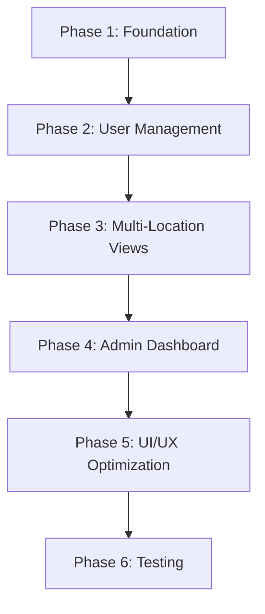

# Administrator Module Implementation Plan

## Overview
Implement comprehensive administrator functionality for EV-Wheels management system, focusing on user management, multi-location data visibility, and role assignment capabilities.

## Current State Analysis
- ✅ Basic admin role exists in auth system
- ✅ Location-based filtering partially implemented
- ✅ Basic role permissions defined (admin, manager, technician)
- ✅ Manager dashboard exists (needs rename to front_desk_manager)
- ❌ No user management interface for admin
- ❌ Multi-location data visibility not implemented for admin
- ❌ Role rename: manager → front_desk_manager needed
- ❌ User creation/role assignment interface missing

## Target Roles Architecture
```
Administrator (admin)
├── Full system access
├── Multi-location visibility
├── User management capabilities
└── Role assignment powers

Front Desk Manager (front_desk_manager)
├── Customer management
├── Ticket creation/viewing
├── Basic reporting
└── Single location scope

Technician (technician)
├── Battery/vehicle management
├── Ticket updates
├── Single location scope
└── Limited customer access
```

---

## Phase 1: Foundation & Role System Enhancement
**Duration: 2-3 days**

### 1.1 Role System Updates
- [ ] Rename `manager` role to `front_desk_manager` in `src/lib/auth/roles.ts`
- [ ] Update existing role permissions (keep current manager permissions for front_desk_manager)
- [ ] Update role display names and descriptions
- [ ] Ensure backward compatibility during transition

### 1.2 Database & Existing Data Migration
```sql
-- Update existing 'manager' role to 'front_desk_manager' in:
-- - user_metadata in auth.users
-- - app_roles table
-- - any enum constraints
UPDATE app_roles SET role = 'front_desk_manager' WHERE role = 'manager';
UPDATE auth.users SET raw_user_meta_data = 
  jsonb_set(raw_user_meta_data, '{role}', '"front_desk_manager"') 
  WHERE raw_user_meta_data->>'role' = 'manager';
```

### 1.3 Authentication Layer Updates
- [ ] Update auth hooks to handle role rename
- [ ] Update role-based route protection
- [ ] Update navigation permissions (manager → front_desk_manager)
- [ ] Update existing manager dashboard references
- [ ] Test role-based access control with renamed role

**Deliverables:**
- Role rename: manager → front_desk_manager completed
- Existing manager dashboard now works as front_desk_manager dashboard
- Database migration completed for existing users
- Updated permission framework

---

## Phase 2: User Management Interface
**Duration: 3-4 days**

### 2.1 User Management API Layer
- [ ] Create user management API endpoints
  - `GET /api/admin/users` - List all users
  - `POST /api/admin/users` - Create new user
  - `PUT /api/admin/users/:id` - Update user details
  - `PUT /api/admin/users/:id/role` - Update user role
  - `DELETE /api/admin/users/:id` - Deactivate user
  - `GET /api/admin/locations` - List locations for assignment

### 2.2 User Management Components
- [ ] Create `src/app/dashboard/admin/users/page.tsx`
- [ ] Create `src/components/admin/user-management/`
  - `users-data-table.tsx` - Main users table
  - `user-create-dialog.tsx` - New user creation
  - `user-edit-dialog.tsx` - Edit existing user
  - `role-assignment-dialog.tsx` - Role assignment interface
  - `location-assignment-dialog.tsx` - Location assignment
  - `user-status-toggle.tsx` - Activate/deactivate users

### 2.3 User Management Features
- [ ] User creation with email invitation
- [ ] Role assignment dropdown (admin, front_desk_manager, technician)
- [ ] Location assignment (single or multiple for admin)
- [ ] User status management (active/inactive)
- [ ] Bulk actions for user management
- [ ] Search and filter capabilities

**Deliverables:**
- Complete user management interface
- User creation and role assignment functionality
- Location assignment capabilities

---

## Phase 3: Multi-Location Data Visibility
**Duration: 4-5 days**

### 3.1 Location-Aware Data Layer
- [ ] Update existing API endpoints to support admin multi-location access
  - `src/lib/api/service-tickets.supabase.ts`
  - `src/lib/api/batteries.supabase.ts` 
  - `src/lib/api/vehicles.supabase.ts`
- [ ] Add location column display in data tables
- [ ] Create location filtering components

### 3.2 Tickets Multi-Location View
- [ ] Update `src/app/dashboard/tickets/page.tsx`
- [ ] Add location column to tickets table
- [ ] Create location filter dropdown
- [ ] Add location-based quick filters
- [ ] Update ticket detail pages to show location info

### 3.3 Batteries Multi-Location View  
- [ ] Update `src/app/dashboard/batteries/page.tsx`
- [ ] Add location column to batteries table
- [ ] Location-based filtering
- [ ] Location info in battery detail pages
- [ ] Multi-location battery status dashboard

### 3.4 Vehicles Multi-Location View
- [ ] Update `src/app/dashboard/vehicles/page.tsx`
- [ ] Add location column to vehicles table
- [ ] Location-based filtering and search
- [ ] Location info in vehicle detail pages
- [ ] Multi-location vehicle status tracking

**Deliverables:**
- Admin can view data from all locations
- Location information displayed in all relevant views
- Location-based filtering capabilities

---

## Phase 4: Enhanced Admin Dashboard
**Duration: 2-3 days**

### 4.1 Admin-Specific Dashboard
- [ ] Create `src/components/dashboard/admin-enhanced-dashboard.tsx`
- [ ] Multi-location KPI cards
- [ ] Cross-location performance metrics
- [ ] User activity monitoring
- [ ] System health indicators

### 4.2 Location Management Interface
- [ ] Create `src/app/dashboard/admin/locations/page.tsx`
- [ ] Location CRUD operations
- [ ] Location settings management
- [ ] Location-specific configuration

### 4.3 System Administration Tools
- [ ] Create `src/app/dashboard/admin/system/page.tsx`
- [ ] System logs viewer
- [ ] Database maintenance tools
- [ ] Configuration management
- [ ] Backup/export utilities

**Deliverables:**
- Enhanced admin dashboard with multi-location insights
- Location management interface
- System administration tools

---

## Phase 5: Role-Based UI/UX Optimization
**Duration: 2-3 days**

### 5.1 Navigation Enhancements
- [ ] Update sidebar navigation for admin users
- [ ] Add "Administration" section to nav
- [ ] Role-based menu items
- [ ] Admin-specific quick actions

### 5.2 Front Desk Manager Interface (Already Exists)
- [ ] ✅ Current manager dashboard serves as front desk manager interface
- [ ] Update component names and references from 'manager' to 'front_desk_manager'
- [ ] Verify current functionality meets front desk manager needs
- [ ] Add any missing front desk specific features if needed

### 5.3 Permission-Based Component Visibility
- [ ] Audit all components for proper permission checks
- [ ] Hide/show features based on role
- [ ] Add permission-based tooltips/explanations
- [ ] Implement graceful permission denial messages

**Deliverables:**
- Role-optimized user interfaces
- Permission-based component visibility
- Streamlined workflows for each role

---

## Phase 6: Testing & Security Audit
**Duration: 2-3 days**

### 6.1 Role-Based Testing
- [ ] Test all user creation flows
- [ ] Verify role assignment functionality
- [ ] Test multi-location data access
- [ ] Validate permission enforcement

### 6.2 Security Verification
- [ ] Audit RLS policies for multi-location access
- [ ] Verify admin-only API endpoints
- [ ] Test unauthorized access scenarios
- [ ] Validate data isolation between roles

### 6.3 Performance Testing
- [ ] Test multi-location queries performance
- [ ] Optimize database queries for admin views
- [ ] Load testing for user management operations
- [ ] Cache optimization for location-based data

**Deliverables:**
- Comprehensive test coverage
- Security audit results
- Performance optimization

---

## Implementation Order & Dependencies



## Technical Considerations

### Database Changes Needed
```sql
-- Add front_desk_manager to role enum (if using enum)
-- Ensure user_locations table supports multiple locations per user
-- Add location_id columns where missing
-- Create indexes for multi-location queries
```

### API Security
- Ensure admin-only endpoints are properly protected
- Validate location access permissions
- Implement rate limiting for user management operations
- Add audit logging for admin actions

### Performance Considerations
- Index location_id columns for fast filtering
- Implement pagination for multi-location data views
- Cache location information for dropdown menus
- Optimize RLS policies for admin queries

## Files to Create/Modify

### New Files
```
src/app/dashboard/admin/
├── users/page.tsx
├── locations/page.tsx
└── system/page.tsx

src/components/admin/
├── user-management/
│   ├── users-data-table.tsx
│   ├── user-create-dialog.tsx
│   ├── user-edit-dialog.tsx
│   ├── role-assignment-dialog.tsx
│   └── location-assignment-dialog.tsx
└── location-management/
    ├── locations-table.tsx
    └── location-form.tsx

src/lib/api/admin/
├── users.ts
└── locations.ts
```

### Files to Modify
```
src/lib/auth/roles.ts - Rename manager to front_desk_manager
src/lib/api/service-tickets.supabase.ts - Multi-location support
src/lib/api/batteries.supabase.ts - Multi-location support  
src/lib/api/vehicles.supabase.ts - Multi-location support
src/app/dashboard/tickets/page.tsx - Location column
src/app/dashboard/batteries/page.tsx - Location column
src/app/dashboard/vehicles/page.tsx - Location column
src/components/layout/app-sidebar.tsx - Admin navigation
src/components/dashboard/manager-* - Rename to front-desk-manager-*
src/constants/data.ts - Update role references in navigation
```

## Success Metrics
- [ ] Admin can create users and assign roles
- [ ] Admin can view tickets/batteries/vehicles from all locations
- [ ] Location information is visible in all relevant tables
- [ ] Front desk manager role functions properly
- [ ] All role-based permissions work correctly
- [ ] Multi-location filtering performs well
- [ ] User management operations complete successfully

## Risk Mitigation
- **Data Security**: Implement thorough RLS policy testing
- **Performance**: Monitor query performance with multi-location data
- **User Experience**: Ensure role transitions don't break existing workflows
- **Data Integrity**: Validate location assignments and role changes

---

**Total Estimated Duration: 15-21 days**
**Priority: High**
**Dependencies: Current auth system, location framework**
