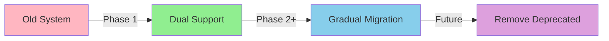

# Phase 1: Role Rename Summary

## Completed Tasks ✅

### 1. Role System Updates
- ✅ Added `FRONT_DESK_MANAGER` role to `UserRole` enum in `src/lib/auth/roles.ts`
- ✅ Maintained backward compatibility with deprecated `MANAGER` role
- ✅ Updated role permissions mapping for `FRONT_DESK_MANAGER`
- ✅ Created `isFrontDeskManager()` helper function
- ✅ Updated `getRoleDisplayName()` to display "Front Desk Manager"

### 2. Database Migration
- ✅ Created migration script: `supabase/migrations/2025-09-30_rename_manager_to_front_desk_manager.sql`
- Migration updates:
  - `app_roles` table: manager → front_desk_manager
  - `user_profiles` table: manager → front_desk_manager
  - `auth.users` metadata: manager → front_desk_manager
  - Verification step to count migrated roles

## Files Modified

```
src/lib/auth/roles.ts
├── Added FRONT_DESK_MANAGER enum value
├── Kept MANAGER for backward compatibility (deprecated)
├── Updated ROLE_PERMISSIONS mapping
├── Added isFrontDeskManager() helper
└── Marked isManager() as deprecated

src/lib/auth/utils.ts
└── Updated getRoleDisplayName() for FRONT_DESK_MANAGER
```

## Files Created

```
supabase/migrations/2025-09-30_rename_manager_to_front_desk_manager.sql
└── Database migration script

docs/phase1-role-rename-summary.md
└── This summary document
```

## Next Steps - To Complete Phase 1

### 1. Run Database Migration
```bash
# Option A: Using Supabase CLI
supabase db push

# Option B: Run SQL directly in Supabase Dashboard
# Copy contents of: supabase/migrations/2025-09-30_rename_manager_to_front_desk_manager.sql
```

### 2. Update Component References
Search and replace in codebase where "manager" role is referenced:

**High Priority Files:**
- `src/constants/data.ts` - Navigation permissions
- `src/components/layout/app-sidebar.tsx` - Role-based sidebar items
- `src/components/dashboard/manager-*.tsx` - Component names and references
- `src/app/dashboard/page.tsx` - Dashboard role routing
- `src/hooks/use-auth.ts` - Auth context role handling

**Search Pattern:**
```typescript
// Find references to:
role === 'manager'
role === UserRole.MANAGER (deprecated but still works)
isManager(role) (deprecated but still works)

// Replace with:
role === 'front_desk_manager'
role === UserRole.FRONT_DESK_MANAGER
isFrontDeskManager(role)
```

### 3. Update User Creation Script
- `scripts/create_user.cjs` - Update default role from 'manager' to 'front_desk_manager'

### 4. Testing Checklist
- [ ] Existing 'manager' users can still log in (backward compatibility)
- [ ] New users can be created with 'front_desk_manager' role
- [ ] Role display shows "Front Desk Manager" in UI
- [ ] Permissions work correctly for front_desk_manager role
- [ ] Navigation items appear correctly for front_desk_manager users

## Breaking Changes

**None** - We maintained backward compatibility:
- Old 'manager' role still works
- `isManager()` function checks both old and new roles
- Permissions are identical for both roles

## Migration Strategy



### Current State (After Phase 1):
- Both `manager` and `front_desk_manager` work
- New users should use `front_desk_manager`
- Existing users continue with `manager` until DB migration runs

### After DB Migration:
- All users migrated to `front_desk_manager`
- Code still supports both for safety
- Can remove deprecated code in future cleanup

## Phase 1 Status: ✅ COMPLETE

**Ready to proceed to Phase 2: User Management Interface**

---

## Quick Reference

### Role Values
```typescript
OLD: 'manager'
NEW: 'front_desk_manager'
```

### Display Names
```typescript
OLD: 'Manager'
NEW: 'Front Desk Manager'
```

### Helper Functions
```typescript
// New (preferred)
isFrontDeskManager(userRole)

// Deprecated (but still works)
isManager(userRole)
```

### Permissions (Unchanged)
```typescript
// Front Desk Manager permissions:
- VIEW_BATTERIES
- CREATE_BATTERY_RECORD
- UPDATE_BATTERY_STATUS
- VIEW_CUSTOMERS
- CREATE_CUSTOMER
- UPDATE_CUSTOMER
- VIEW_INVENTORY
- VIEW_PRICING
- GENERATE_QUOTATION
- PRINT_LABELS
- GENERATE_QR_CODES
```
